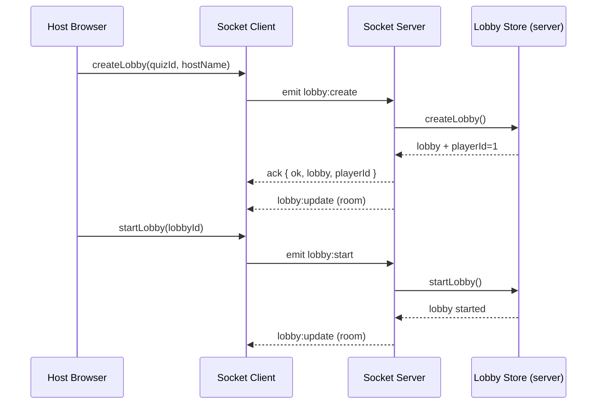
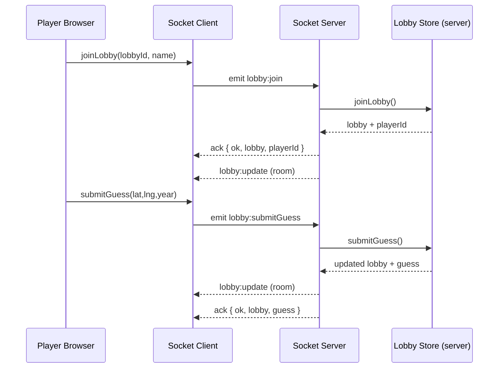

# Project Logic (Timequiz / TimeGuessr)

This document explains how the project works end to end: server + sockets, data storage, game lifecycle, Leaflet map usage, and how images are handled. It is based on the current code in this repo and points to the key files to read if you want to change behavior.

---

## 1) Architecture

Two separate processes run in dev:
- Vite dev server serves the Vue frontend.
- Socket.IO server handles realtime state (lobbies, guesses, points) and quiz CRUD.

There is no HTTP API. Everything is driven by Socket.IO events.

Key files:
- Frontend entry: `src/main.js`
- Frontend routes: `src/router/index.js`
- Socket client: `src/services/socketService.js`
- Socket server: `server/index.js`, `server/sockets.js`
- Server state: `server/lobbyStore.js`

---

## 2) Runtime flow (what starts, what connects)

### 2.1 Dev scripts
- `npm run dev` runs both:
  - `vite` (frontend)
  - `nodemon server/index.js` (socket server)

### 2.2 Socket server boot
File: `server/index.js`
- Creates a bare HTTP server and mounts Socket.IO on it.
- CORS is controlled by `CLIENT_ORIGIN` env (comma-separated list) or defaults to `true` (allow all).
- Starts on `HOST`/`PORT` (default `0.0.0.0:3000`).
- If port is busy or restricted (`EACCES`, `EADDRINUSE`, `EPERM`), it falls back to a random port.
  - Important: the frontend assumes port 3000 unless you set `VITE_SOCKET_URL` or `VITE_SOCKET_PORT`. If the server falls back to a random port, the frontend will not auto-discover it.

### 2.3 Socket client boot
File: `src/services/socketConfig.js`
- If `VITE_SOCKET_URL` is set, it uses that.
- Else it uses the current `window.location` host + protocol and `VITE_SOCKET_PORT` (default 3000).

File: `src/services/socketService.js`
- Creates a single socket instance with `autoConnect: true`.
- Provides `emitWithAck(event, payload)` which wraps Socket.IO acknowledgements with a 5s timeout.

---

## 3) Data model overview

### 3.1 Quizzes (persistent)
File: `server/data/quizes.json`
- Stored as:
  ```json
  {
    "quizes": [
      {
        "id": "...",
        "name": "...",
        "description": "...",
        "questions": [
          {
            "id": "q1",
            "prompt": "...",
            "imageUrl": "...",
            "location": { "lat": 0, "lng": 0, "label": "..." },
            "year": 1960
          }
        ]
      }
    ]
  }
  ```
- This file is loaded into memory on server boot (`server/lobbyStore.js`).
- New quizzes are persisted back to this file with `writeFileSync`.

### 3.2 Lobbies (in-memory only)
File: `server/lobbyStore.js`
- `state.lobbies` is a plain object keyed by lobbyId.
- A lobby is not persisted. If the server restarts, lobbies are lost.

Lobby structure (simplified):
```js
{
  id,
  quizId,
  status: "waiting" | "started" | "finished",
  host: { id: 1, name, points },
  players: [ { id, name, points } ],
  nextId, // next player id
  currentQuestionIndex,
  questionCount,
  guesses: [ { playerId, lat, lng, year, points, name, ts } ], // current question only
  roundGuesses: [ { [playerId]: guessPayload } ], // per-question history
  createdAt,
  updatedAt
}
```

### 3.3 UI labels (JSON files)
Files: `server/data/labels-*.json`
- Full UI dictionaries for TimeGuessr (home, play, lobby, game, host, create, results, shared labels).
- Delivered by the `getUILabels` socket event.
- The client-side `uiStore` requests these labels and exposes a `getLabel()` helper so all views swap language at runtime.

---

## 4) Socket events and responsibilities

File: `server/sockets.js`

### 4.1 Lobby + quiz events (current game)
These are the main events used by the current UI.

**`lobby:create`**
- Payload: `{ quizId, hostName }`
- Server: creates lobby, joins socket to room `lobby.id`, emits `lobby:update` to room.
- Ack: `{ ok, lobby, playerId }` (host is always `playerId = 1`).

**`lobby:get`**
- Payload: `{ lobbyId }` or just a lobby id string
- Server: joins socket to room `lobby.id` and returns the lobby.
- Ack: `{ ok, lobby }`

**`lobby:join`**
- Payload: `{ id, name }`
- Server: adds player, joins room, emits `lobby:update` to room.
- Ack: `{ ok, lobby, playerId }`

**`lobby:start`**
- Payload: `{ lobbyId }`
- Server: sets status to `started`, resets points, clears guesses, prepares per-round data.
- Emits `lobby:update` to room.

**`lobby:previous`** and **`lobby:next`**
- Payload: `{ lobbyId }`
- Server: moves `currentQuestionIndex`, clears guesses.
- If advancing past last question, status becomes `finished`.
- Emits `lobby:update` to room.

**`lobby:submitGuess`**
- Payload: `{ lobbyId, playerId, lat, lng, year, name? }`
- Server: calculates points, updates player points (and rewinds prior points if resubmitted).
- Updates current-question guesses and per-round history.
- Emits `lobby:update` to room and returns the submitted guess.

**`quiz:list`**
- Payload: none
- Server: returns the current list of quizzes from memory.

**`quiz:create`**
- Payload: `{ name, description, questions, id? }`
- Server: validates, normalizes, writes to `server/data/quizes.json`.
- Broadcasts `quiz:updated` to all clients.

**Server-to-client push events**
- `lobby:update` is broadcast to the lobby room whenever lobby state changes.
- `quiz:updated` is broadcast to all clients whenever quizzes change.

### 4.2 UI label event
**`getUILabels`**
- Payload: language code (`"en"` or `"sv"`)
- Server: reads `server/data/labels-<lang>.json` and returns it
- Response event: `uiLabels`

---

## 5) Server-side logic details

### 5.1 Quiz creation and normalization
File: `server/lobbyStore.js`
- `addQuiz(payload)` validates required fields and normalizes questions:
  - `name` must be non-empty.
  - At least one question required.
  - Each question must include a valid `year` and `location` (lat/lng numeric).
- `id` is auto-generated if not provided (slugified name; `quiz-2`, `quiz-3`, etc.).

### 5.2 Lobby lifecycle
File: `server/lobbyStore.js`
- `createLobby(quizId, hostName)`
  - Generates a 5-char uppercase lobby id.
  - Host is always `id = 1`.
  - `players` excludes the host.
- `joinLobby(lobbyId, name)`
  - Adds player with incremental `id` starting at 2.
  - Caps players at 5 (host does not count toward the 5).
- `startLobby(lobbyId)`
  - Sets status to `started` (or `finished` if no questions).
  - Clears guesses and resets points.
- `advanceQuestion(lobbyId, delta)`
  - `delta = -1` for previous, `delta = +1` for next.
  - When moving forward past last question, sets status to `finished`.
- `submitGuess(lobbyId, guess)`
  - Stores the guess for the current round and calculates points.
  - If a player resubmits, their previous points for the round are removed before adding the new score.

### 5.3 Scoring logic
File: `server/lobbyStore.js`

Points = distance score + year score

- Distance score:
  - Uses haversine distance in kilometers.
  - `distanceScore = round(1000 / (1 + distanceKm / 200))`
  - Closer is higher; long distances shrink toward 0.
- Year score:
  - Exponential decay with half-life of 5 years.
  - `yearScore = round(1000 * 0.5^(yearDiff / 5))`

---

## 6) Client flow (host and player)

### 6.1 Create or join a lobby
Files: `src/views/PlayView.vue`, `src/components/JoinLobbyForm.vue`
- Host flow:
  1) Choose quiz.
  2) `lobby:create` -> receives lobby id + host player id.
  3) Navigate to `/lobby?lobby=ID&player=1&quiz=...`.
- Player flow:
  1) Enter lobby id + name.
  2) `lobby:join` -> receives lobby id + player id.
  3) Navigate to `/lobby?lobby=ID&player=PID&quiz=...`.

### 6.2 Lobby screen
File: `src/views/LobbyView.vue`
- Shows lobby status and players.
- Host sees Start Game button.
- Non-hosts wait; they auto-route to `/game` when lobby status switches to `started`.

### 6.3 Game screen (player)
File: `src/views/GameView.vue`
- Loads quiz + lobby data and listens for updates.
- Shows current question image and a Leaflet map for guessing.
- Clicking the map sets `playerGuess` and drops a temporary marker.
- A year slider lets the player choose a year.
- Clicking "Make My Guess" emits `lobby:submitGuess`.

Note: The player map is always centered on Europe by default, and the year slider resets to 1950 for each new question.

### 6.4 Host screen
File: `src/views/HostView.vue`
- Displays scoreboard (players only; host is not listed).
- Shows a big Leaflet map with markers for all current guesses.
- Host controls:
  - Previous question
  - Next question
  - End game (navigates to results)

### 6.5 Results screen
File: `src/views/ResultView.vue`
- Uses the lobby data to rank players by points.
- Host is not included in the results list (only `lobby.players`).

### 6.6 Sequence diagrams (host and player)

Host creates lobby and starts game:


Player joins and submits a guess:


---

## 7) Client state management

### 7.1 Lobby store
File: `src/stores/lobbyStore.js`
- Keeps a reactive `lobbies` map keyed by lobby id.
- Listens for `lobby:update` and merges latest lobby state.
- Provides methods for create/join/start/advance/submit.

### 7.2 Quiz store
File: `src/stores/quizStore.js`
- Bootstraps quizzes from a JSON import of `server/data/quizes.json`.
- Syncs with server via:
  - `quiz:list` (on demand)
  - `quiz:updated` (push updates)

### 7.3 UI store (language)
File: `src/stores/uiStore.js`
- Keeps the active `lang`, the latest `labels`, and persists the choice in `localStorage`.
- Requests labels via `getUILabels` and updates on socket reconnects.
- `getLabel(key, fallback)` is used across views/components to swap text instantly.
- The shared header (`src/components/AppHeader.vue`) shows the title and a flag-based EN/SV toggle.

---

## 8) Leaflet map usage

### 8.1 Map component
File: `src/components/LeafletMap.vue`
- Creates a Leaflet map with a CARTO light basemap.
- Accepts props:
  - `center` [lat, lng]
  - `zoom`
  - `markers` (array of `{ lat, lng, label }`)
  - `clickable` (enables click handler)
  - `allowGuessMarker` (places a temporary marker on click)
  - `guessMarker` (external marker position)
- Emits `map-click` with `{ lat, lng }` when clickable.
- Re-renders markers when props change.

### 8.2 Where maps are used
- `CreateQuizView.vue`: clickable map to set the correct location.
- `GameView.vue`: clickable map to let players guess.
- `HostView.vue`: non-clickable map showing all current guesses.

### 8.3 Leaflet icon handling
File: `src/main.js`
- Manually configures Leaflet marker icons to avoid broken image URLs after bundling.

---

## 9) Image handling

There is no image upload or storage service.

Images are stored as a URL string in quiz questions:
- In Create Quiz, the user pastes an image URL.
- That URL is saved into `server/data/quizes.json` when the quiz is created.
- Game view simply renders `` from the quiz data.

If you want local images:
- Put them in `public/` and reference them with `/your-image.jpg` in the image URL field.
- No processing or validation happens on the server.

---

## 10) Notable constraints and caveats

- Lobbies are in-memory only. Restarting the socket server wipes all active games.
- There is no authentication or host enforcement on the server; any client could emit host events if they know the lobby id.
- The server can fall back to a random port if 3000 is unavailable; the frontend will not follow automatically unless you set `VITE_SOCKET_URL` or `VITE_SOCKET_PORT`.
- `HostView` and `ResultView` only show `lobby.players`, not the host.

---

## 11) Quick file map

- Socket server entry: `server/index.js`
- Socket event handlers: `server/sockets.js`
- Game data store: `server/lobbyStore.js`
- Quiz data file: `server/data/quizes.json`
- Socket client: `src/services/socketService.js`
- Lobby store (client): `src/stores/lobbyStore.js`
- Quiz store (client): `src/stores/quizStore.js`
- UI store (client): `src/stores/uiStore.js`
- Leaflet map component: `src/components/LeafletMap.vue`
- App header: `src/components/AppHeader.vue`
- Views: `src/views/*View.vue`
